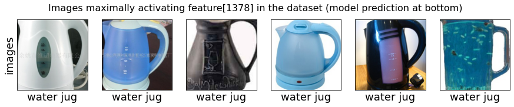
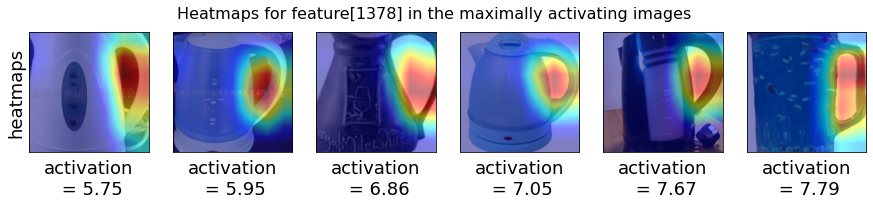

# Welcome to Barlow


Barlow is a tool for identifying the failure modes for a given neural network. To achieve this, Barlow first creates a group of images such that all images in the given group have the same predicted class or the label. Then, it uses a (possibly separate) robust model to extract the embedding for all images in the group. The embedding encodes the human-interpretable visual attributes present in the image. It then learns a decision tree using this embedding that predicts failure on the neural network being inspected for failure. 

## Prerequisites

+ Python 3.7+
+ Pytorch 1.6+
+ scikit-learn 0.23+
+ scipy 1.5+
+ matplotlib 3.2+

## How to run?

+ The robust model is taken from the [robustness library](https://github.com/MadryLab/robustness) and can be downloaded from [this link](https://www.dropbox.com/s/knf4uimlqsi1yz8/imagenet_l2_3_0.pt?dl=0) in models/
+ Run failure_explanation_sample.ipynb to identify example failure modes for the given set of images (in sample_data/) using the robust model located in models/.

## Example failure mode

For the images with label water jug, when feature[1378] (visually identified as 'water jug handle') is less than 0.089335, error rate increases to 100.0% from 50.0%, i.e an increase of 50.0% in the failure rate.





## Citation

```
@inproceedings{singlaCVPR2021,
    title={Understanding Failures of Deep Networks via Robust Feature Extraction},
    author={Sahil Singla and Besmira Nushi and Shital Shah and Ece Kamar and Eric Horvitz},
    booktitle={The IEEE Conference on Computer Vision and Pattern Recognition (CVPR)},
    year={2021}
}
```
